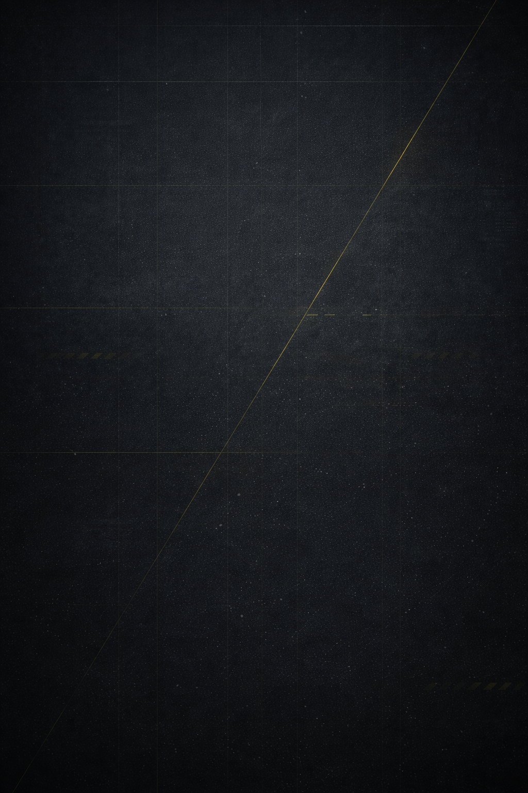

<div align="center">
  
  
  <h1> Helldivers - Super Earth Command</h1>
  
  <p>
    <strong>A futuristic web application dedicated to the brave Helldivers fighting for Super Earth's freedom</strong>
  </p>
  
  <p>
    <a href="#about">About</a> •
    <a href="#features">Features</a> •
    <a href="#demo">Demo</a> •
    <a href="#technologies">Technologies</a> •
    <a href="#getting-started">Getting Started</a> •
    <a href="#usage">Usage</a> •
    <a href="#contributing">Contributing</a> •
    <a href="#license">License</a>
  </p>
</div>

---

## 📖 About The Project

<div align="center">
  
</div>

**Helldivers - Super Earth Command** is a modern, multi-language web application themed around the Helldivers universe. Built with React and featuring a sleek sci-fi aesthetic, this platform serves as a central hub for mission briefings, news updates, and galactic defense information.

### Main Page Description

The homepage features:
- **Dynamic Header Navigation**: An animated skewed header with dropdown menu containing links to Home, Missions, Arsenal, and Settings
- **News Section**: Three news cards displaying the latest updates from the Helldivers command
- **Futuristic UI**: Custom fonts (HandelGothic BT), neon cyan accents, and yellow highlights creating an immersive helldiver experience
- **Language Selector**: Fixed-position buttons (ES/EN) in the top-right corner for instant language switching
- **Footer**: Contains copyright information and links to the cookies policy page

### Why This Project?

This project was created as a demonstration of:
- Modern React development practices
- Internationalization (i18n) implementation
- Creative UI/UX design inspired by sci-fi aesthetics
- Component-based architecture
- Responsive web design principles

---

## ✨ Features

- 🌍 **Multi-language Support**: Full internationalization with Spanish, English, and French translations
- 🎨 **Unique Design**: Custom Helldivers-themed UI with skewed elements and neon effects
- 🧩 **Component-Based**: Modular React components for easy maintenance and scalability
- 🎯 **Mission System**: Dynamic mission cards loaded from JSON data
- 📰 **News Feed**: Dedicated news section for updates and announcements
- 🍪 **Cookie Policy**: Satirical yet informative cookies page in Helldivers style
- 🎮 **Interactive Elements**: Hover effects, animations, and smooth transitions

---

## 🚀 Getting Started

### Installation

1. **Clone the repository**
   ```bash
   git clone https://github.com/albertoGF-dawt/Helldivers-project/
   cd helldivers-web
   ```

2. **Install dependencies**
   ```bash
   npm install
   ```

3. **Start the development server**
   ```bash
   npm run dev
   ```

4. **Open your browser**
   Navigate to `http://localhost:5173`

## 💡 Usage

### Changing Languages

Click on the language selector buttons (ES/EN) in the top-right corner to switch between Spanish, English.

### Navigation

Use the header menu to navigate between:
- **Home**: Main landing page with news
- **Missions**: View available Helldivers missions
- **Cookies**: Information about cookie usage (satirical Helldivers style)

### Adding New Missions

Edit the `src/data/missions.json` file:

```json
{
  "id": 3,
  "title": "New Mission Title",
  "description": "Mission description here",
  "image": "https://your-image-url.com/image.png"
}
```

Then add translations in `src/main.jsx`:

```javascript
"missions.mission3.title": "New Mission Title",
"missions.mission3.description": "Mission description here"
```

---

## 📂 Project Structure

```
helldivers-web/
├── public/
│   ├── font.png                 # Background image
│   └── handelgothic-bt/        # Custom font files
├── src/
│   ├── components/
│   │   ├── Header.jsx          # Navigation header
│   │   ├── Footer.jsx          # Page footer
│   │   ├── News.jsx            # News section
│   │   └── LanguageSelector.jsx # Language switcher
│   ├── pages/
│   │   ├── home/
│   │   │   └── Home.jsx        # Homepage
│   │   ├── missions/
│   │   │   └── Missions.jsx    # Missions page
│   │   └── cockies/
│   │       └── Cockies.jsx     # Cookies policy page
│   ├── data/
│   │   └── missions.json       # Mission data
│   ├── App.jsx                 # Main app component
│   ├── main.jsx                # Entry point with i18n config
│   └── index.css               # Global styles
├── package.json
├── vite.config.js
└── README.md
```
---
<div align="center">
  <p><strong>For Super Earth! 🌍⚡</strong></p>
  <p><em>Join the fight for democracy across the galaxy</em></p>
</div>
